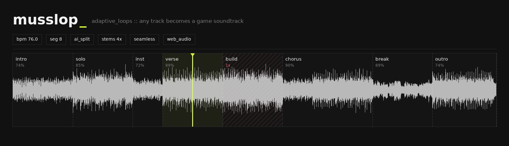

<p align="center">
  
</p>

<h3 align="center">Turn any music track into an adaptive, game-style soundtrack</h3>

<p align="center">
  
  
  
  
</p>

<p align="center">
  <b>Loop any section forever · hit «Next» · the track evolves — seamlessly, on the beat</b>
</p>

---

Game soundtracks don't just play — they *react*. While you stay in one location, a musical
section loops forever; when you move on, the music seamlessly evolves with you.
**musslop** brings this behaviour to any track:

- 🎼 **Understands the music** — tempo, beats, bars and section structure detected
  automatically (~2 s for a 4-minute track), boundaries snapped to bar lines
- 🔁 **Loops without seams** — sample-accurate Web Audio scheduling, equal-power
  crossfades, per-section loop-quality score (⟳%)
- 🎮 **Evolves on demand** — press **Next** and the transition lands exactly on the
  loop or phrase boundary, like in FMOD/Wwise horizontal re-sequencing
- 📈 **Knows what not to loop** — build-ups/risers are detected by their crescendo
  shape and play once instead of looping
- ✂️ **Fully editable** — drag boundaries, split, merge, set loop-repeat markers;
  export loops as WAV or markup as JSON

## Use cases

- **Game development / prototyping** — audition how any licensed or reference track would
  behave as an adaptive layer before implementing it in FMOD/Wwise; export the loops as
  WAV stems ready for your audio middleware
- **Streaming / content creation** — hold a musical mood for as long as a scene needs,
  advance the track when the moment changes
- **Study & practice** — loop a verse or a solo section endlessly, snapped to bars
- **DJ / live sets** — quick structural map of a track with per-section loop quality scores
- **Focus music** — stretch the part of a track you like to any length

## How it works

**Automatic slicing** (server, `librosa`) is grounded in music-theory-aware MIR
techniques:

1. **Beat tracking** — onset strength envelope + dynamic programming (Ellis, 2007)
   yields tempo and beat positions
2. **Downbeats** — assuming 4/4, the strong-beat phase is chosen as the shift that
   maximizes onset strength on every 4th beat
3. **Structural segmentation** (Foote, 2000) — beat-synchronous features
   (CQT chroma for harmony, MFCC for timbre, RMS for dynamics) → self-similarity
   matrix → checkerboard-kernel novelty curve → peaks become section boundaries
   (intro / verse / chorus / bridge...)
4. **Boundary refinement** — each boundary searches downbeats within ±1 bar of the
   novelty peak and picks the one with the strongest onset and the biggest RMS jump —
   this handles sections that start with a pickup (anacrusis)
5. **Musical quantization** — boundaries snap to downbeats; sections are never shorter
   than a musical phrase (2–4 bars)
6. **Section labelling** — agglomerative clustering of per-section features names
   repeated sections alike (`A1, B1, C1, B2...`)
7. **Loop quality score** — spectral similarity between each section's head and tail
   plus level continuity estimates how seamlessly it will loop (shown as ⟳%)

**Playback** (browser, Web Audio API): every loop pass is scheduled as a separate
`AudioBufferSourceNode` with sample-accurate timing; 6 ms micro-fades remove clicks.
Press **Next** and the upcoming chunk is taken from the next section — the transition
lands exactly on the loop boundary (or on the next phrase boundary in `phrase end`
mode), optionally with a crossfade.

### What is a crossfade?

A **crossfade** is overlapping two pieces of audio while the first *fades out*
and the second *fades in*. Instead of a hard cut at the seam (which can sound
jerky when the waveforms don't line up), the two signals coexist for a short
time — the ear hears a smooth blend instead of a jump.

musslop uses an **equal-power** crossfade: gain follows cosine/sine curves so
that the *combined loudness* stays constant during the overlap (a naive linear
fade dips in the middle, which is audible). The crossfade slider (0–2 s) applies
to both **loop repeats** (the tail of a pass overlaps the head of the next pass,
masking an imperfect seam) and **section transitions**. Rules of thumb:

- `0 s` — pure gapless splice with 6 ms anti-click micro-fades; best when the
  boundary sits exactly on a bar line and the loop quality score (⟳%) is high
- `0.3–0.8 s` — hides most seam artifacts in dense/ambient material
- `1–2 s` — cinematic blend for pads and atmospheres; too long for rhythmic
  music (transients from both parts overlap and can smear the groove)

## Quick start

```bash
pip install -r requirements.txt   # ffmpeg must be in PATH
./run.sh                          # default port 8801; or: ./run.sh 9000
```

Open http://localhost:8801

`run.sh` frees the port from a stale process, checks dependencies and logs to `server.log`.

## Features

- Drag & drop any audio file (mp3, wav, ogg, flac, m4a...)
- Automatic structure analysis: tempo, beats, bars, sections — ~2 s for a 4-minute track
- Waveform editor:
  - drag boundaries (with snap-to-bar), double-click to split, ✕ to merge
  - mouse wheel zoom + Shift+wheel pan, with minimap
  - draggable playhead, click-to-seek
  - live editing — boundary changes apply to playback immediately
- Player: seamless looping, **Next** button, two transition modes
  (*loop end* / *phrase end* — advance on a 4/8-bar phrase boundary),
  adjustable crossfade (0–2 s)
- Build-up detection: sections with a directed crescendo (rising RMS +
  spectral brightness) are flagged as *transitions* and play once instead
  of looping; per-section loop toggle and a draggable *loop repeat start*
  marker (first pass plays the whole part, repeats start from the marker)
- Suggested and maximum part counts reported by the analyzer; the user
  picks the actual number
- Per-section loop quality indicator (⟳%), auto-recomputed after edits
- Section labels by similarity clustering (A/B/A/C)
- Export: segment markup as JSON (re-importable), all loops as a zip of WAVs
- UI in English and Russian
- Keyboard: `Space` — play/stop, `→`/`Enter` — next

## API

| Endpoint | Description |
|---|---|
| `POST /api/upload` | multipart upload, returns `track_id` |
| `GET /api/analyze/{id}?n_segments=N` | structure analysis (N optional) |
| `GET /api/audio/{id}` | original audio file |
| `POST /api/loopability/{id}` | loop quality for a custom segment list |
| `POST /api/export/{id}` | zip of WAV loops for a custom segment list |
| `GET /api/health` | liveness check |

## Project layout

```
backend/
  main.py       # FastAPI: upload, analyze, export, static
  analysis.py   # beat tracking, downbeats, novelty segmentation, labelling
frontend/
  index.html    # React (self-hosted CDN-free) + Web Audio player & editor
  vendor/       # react, react-dom, babel-standalone (pinned versions)
run.sh          # launcher with port cleanup
```

## Troubleshooting

1. **Is the server alive?** `curl http://localhost:8801/api/health` →
   should return `{"status": "ok", ...}`
2. **Blank page / no buttons** — open the browser console (`F12` → Console) for JS
   errors; hard-refresh with `Ctrl+F5`
3. **Port busy** — `./run.sh` kills the stale process itself; manually:
   `lsof -ti tcp:8801 | xargs kill`
4. **Analysis/upload errors** — check `server.log` for the Python traceback
5. **File fails to decode** — verify `ffmpeg -i yourfile` works in a terminal

## References

- D. Ellis. *Beat Tracking by Dynamic Programming*, 2007
- J. Foote. *Automatic Audio Segmentation Using a Measure of Audio Novelty*, 2000
- librosa: https://librosa.org
