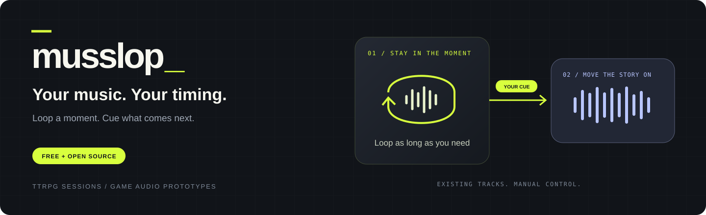
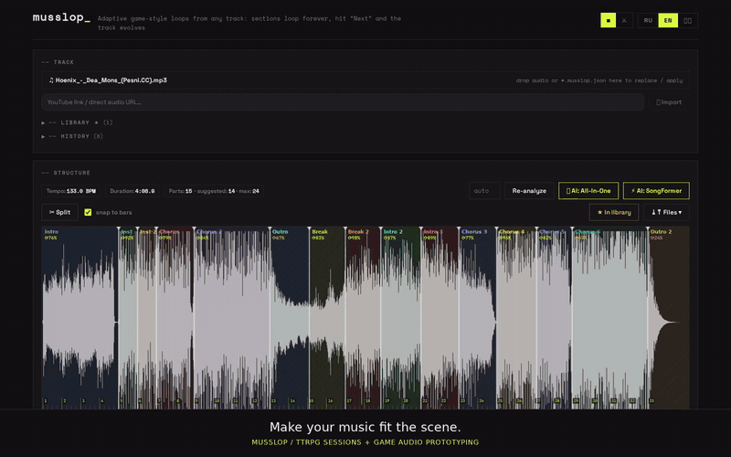

<p align="center">
  
</p>

<h3 align="center">Make your music fit the scene.</h3>

<p align="center">
  <a href="https://www.python.org/"></a>
  <a href="https://fastapi.tiangolo.com/"></a>
  <a href="https://developer.mozilla.org/docs/Web/API/Web_Audio_API"></a>
  <a href="https://github.com/ASLP-lab/SongFormer"></a>
  <a href="https://github.com/mir-aidj/all-in-one"></a>
  <a href="LICENSE"></a>
</p>

<p align="center">
  <b>Your existing music. You decide when it moves on.</b><br>
  Loop a section · cue the next one · export loops for your game
</p>

**musslop** is a free, open-source tool for adapting music tracks to the pacing of
**TTRPG sessions and video game prototypes**. Keep a section looping while a scene
unfolds, then hit **Next** to cue a transition on a musical boundary.

You control the transitions yourself: musslop doesn't listen to your session or
automatically react to gameplay. It helps you work with existing tracks rather than
generating new music.

<p align="center">
  
</p>
<p align="center"><em>30-second silent demo: select → loop → cue → transition.</em></p>

**Free and open source (MIT).** No subscriptions, accounts, registration, or email
collection. Runs locally and works offline after the required dependencies and
models have been downloaded. This is a personal passion project, shared freely.

[Quick start](#quick-start) · [Your first loop](#your-first-loop) · [Features](#features) · [Under the hood](#under-the-hood)

**Read about the project:** [Article on Habr (in Russian)](https://habr.com/ru/articles/1086674/).

## Two ways to use it

| At your TTRPG table | While building your game |
|---|---|
| Keep an atmospheric section going while players explore or talk. Cue the intense part when **you** decide it's time. | Audition section loops, transitions, and intensity changes before implementing them in your game. |
| Operate the soundtrack live with Play and Next. A Tavern UI theme is available in the header. | Export WAV loops for your audio workflow. Playback logic and engine integration remain part of your game project. |

## Features

| Feature | What it does |
|---|---|
| **Structure analysis** | a fast heuristic mode is included in the base setup. Optional [SongFormer](https://github.com/ASLP-lab/SongFormer) and [All-In-One](https://github.com/mir-aidj/all-in-one) models detect and label sections; neural beat/downbeat tracking uses [Beat This!](https://github.com/CPJKU/beat_this) |
| **Loop playback** | sample-accurate Web Audio scheduling, bar-snapped boundaries, per-section loop-quality score (⟳%), equal-power crossfades |
| **Intensity layers** | Demucs splits the track into drums / bass / vocals / backing — toggle and mix layers live: calm exploration → full combat, same track |
| **Transition controls** | outgoing tails, bass-swap, and one-shot stingers (cymbal / boom / riser) help shape section changes |
| **Build-up detection** | suggests crescendo sections that should play once rather than repeat; loop behaviour is editable |
| **Full editor** | drag boundaries with bar snapping, split/merge, loop-start markers, Ctrl+Z, zoom + scrollbar, everything auto-saved |
| **Audition the seam** | ⟲♪ plays the last seconds of a part and then its start; →♪ plays the end of a part into the next one — check a boundary in 6 seconds instead of a whole loop |
| **Cue any part** | while playing, click any part to queue a transition into it — **natural** (loop end), **soon** (next 4/8-bar phrase) or **now** (short crossfade); cancel with Backspace |
| **Scenes** | save the player state (part + layers + speed/crossfade/reverb + how to enter) as a named scene with a hotkey 1–9: *Empty corridor*, *Something is close*, *Ambush*, *Aftermath* — all from one track |
| **Live mode** | full-screen desk for the session (key `L`): big current/next display, scene pads, ETA of the transition, fade-out — editing is locked |
| **Projects (set lists)** | group tracks and scenes for a whole session or level (*Arrival → Inside → Finale*), with notes; open any item in one click |
| **Loop export** | ZIP of WAV sections plus `manifest.json` (loop points, phrase transition points, tails, stingers, scenes) — see the [Godot example](examples/godot) |

**Results depend on the source track.** Automatic boundaries are a starting point,
not a guarantee of perfect loops. Listen to the repeat and transition, adjust the
boundaries, and tune the crossfade when needed. Stem separation can introduce artifacts.

## Quick start

Requires **Python 3.10+** and **Git** for the clone commands below.
The base setup includes heuristic analysis, editing, playback, and loop export;
you can try those before installing the optional neural engines.

Linux / macOS:

```bash
git clone https://github.com/Siziff/musslop.git && cd musslop
./setup.sh   # creates .venv, installs everything (incl. a bundled ffmpeg)
./run.sh     # → http://localhost:8801
```

Windows (needs [Python 3.10+](https://python.org) with "Add to PATH" checked):

```bat
git clone https://github.com/Siziff/musslop.git
cd musslop
setup.bat
run.bat      # → http://localhost:8801
```

ffmpeg is downloaded automatically with the dependencies — no manual install needed.

## Your first loop

1. Open **http://localhost:8801** after starting the server.
2. Drop an audio file into the track area and let the base analysis identify sections.
3. Check a boundary with **⟲♪** (loop seam) or **→♪** (transition into the next part)
   on its chip; drag the boundary on the waveform if the seam is audible.
4. Select a section and press **Play** (or **Space**) to loop it.
5. Press **Next** (or **→ / Enter**) — or click any other part — to queue a transition.
   Pick when it lands: **natural** (loop end), **soon** (phrase), **now** (crossfade).
   **Backspace** cancels a queued transition.
6. Adjust section boundaries if needed; use **Ctrl+Z** to undo an edit.
7. For game audio prototyping, choose **Files → Loops (zip)** to export WAV loops
   with `manifest.json`.

## Running a session

1. Set up the player for a moment of the game (part, layers, speed, reverb) and hit
   **Save scene**. Repeat for every mood you need from this track. Scenes get hotkeys 1–9.
2. Optionally create a **Project**: groups like *Arrival / Inside / Finale* with the tracks
   and scenes of the session, plus notes. Items open in one click and start their scene.
3. At the table press **L** for **Live mode**: a full-screen desk with the current part, what
   comes next and when, scene pads, **Next**, **Cancel** and **Fade out** (`F`). Editing
   shortcuts are disabled while Live is on; `Esc` leaves it.

## Optional neural analysis and layers

Install an optional environment for model-based section analysis and stem separation.
The engines are auto-detected by `run.sh`:

Linux / macOS:

```bash
./setup-ai-songformer.sh  # SongFormer 2025 + Beat This! — newer, faster,
                          # best on pop/rock/electronic; plain pip, no compilers
./setup-ai-allin1.sh      # All-In-One 2023 + Demucs — steadier on orchestral,
                          # also powers the stem "layers" feature
```

Windows:

```bat
setup-ai-songformer.bat   # needs git in PATH; ~15 min, ~4 GB
```

The All-In-One engine is not supported natively on Windows (its NATTEN
dependency needs a source build); use WSL2 with the Linux script if you
need it. SongFormer covers structure analysis fully, and the stem
"layers" feature also works through it on Windows.

Model downloads require an internet connection on first use. Once dependencies and
model weights are available locally, processing works offline. Neural analysis can
take a minute or more on a GPU and longer on a CPU, depending on the model, track,
and hardware; results are cached.

## Feedback and support

Trying musslop at your table or in a game audio workflow? Share what worked and
what got in the way in [GitHub Issues](https://github.com/Siziff/musslop/issues).
For analysis or playback problems, include your OS, analysis engine, and steps to
reproduce the issue.

If this looks useful for your table or game, **a GitHub star helps others discover it**.

## Under the hood

1. **Beat & downbeat tracking** — onset envelope + dynamic programming (Ellis 2007)
2. **Structure** — neural (All-In-One, WASPAA 2023) or Foote novelty on
   beat-synced chroma+MFCC+RMS self-similarity
3. **Loop-aware refinement** — boundaries move along downbeats maximizing loop
   closure quality (head/tail spectral similarity), phrase lengths (4/8 bars) and
   transition audibility
4. **Build-up detection** — normalized RMS slope + trend R² + spectral-centroid rise
5. **Playback** — every loop pass is an independent `AudioBufferSourceNode`;
   transitions land on loop/phrase boundaries with micro-fades, tails and bass-swap

Built on the shoulders of: [SongFormer](https://github.com/ASLP-lab/SongFormer) (ASLP-lab, CC-BY-4.0) ·
[All-In-One](https://github.com/mir-aidj/all-in-one) (Kim & Nam, MIT) ·
[Beat This!](https://github.com/CPJKU/beat_this) (CPJKU, MIT) ·
[Demucs](https://github.com/facebookresearch/demucs) · [librosa](https://librosa.org) —
plus classic MIR: Ellis 2007 (beat tracking), Foote 2000 (novelty segmentation).

## API

| Endpoint | Purpose |
|---|---|
| `POST /api/upload` · `POST /api/import_url` | file upload / yt-dlp import |
| `GET /api/analyze/{id}?engine=fast\|deep` | structure analysis |
| `POST /api/stems/{id}` · `GET /api/stems/{id}/{stem}` | Demucs 4-stem split |
| `POST /api/export/{id}` | zip of full-quality loop WAVs + `manifest.json` (body: `{segments, scenes, tempo, downbeats, tails}`) |
| `GET/POST /api/markup/{id}` | segment markup + scenes persistence |
| `GET /api/tracks` · `POST /api/favorite/{id}` | history & library |
| `GET/POST /api/projects` · `GET/PUT/DELETE /api/projects/{pid}` | projects (set lists): groups of track / scene references |

## Troubleshooting

1. `curl http://localhost:8801/api/health` → expect `{"status":"ok", ...}`
2. Blank page → hard-refresh (`Ctrl+F5`), check browser console (`F12`)
3. Port busy → `./run.sh` frees it; manually: `lsof -ti tcp:8801 | xargs kill`
4. No sound → click the ♪? self-test in the volume box (bottom-right)
5. Server errors → `server.log`
